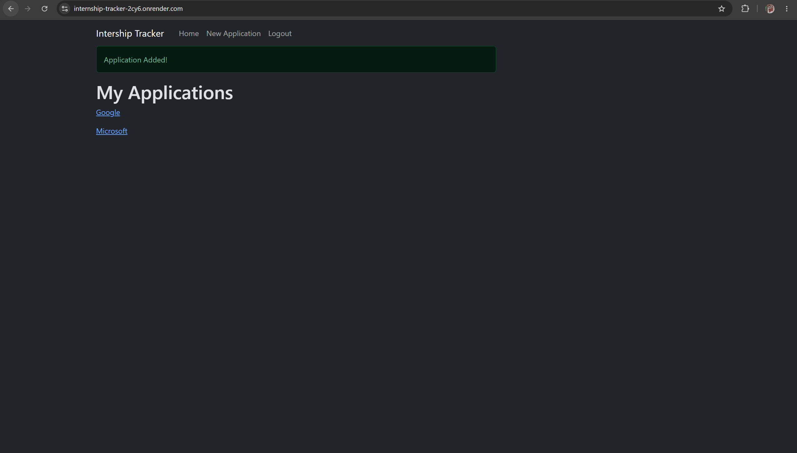

# Internship Tracker  
a web app for tracking internship applications

*Note: Hosted on a free tier - first load may take up to a minute.*
[Live demo](https://internship-tracker-2cy6.onrender.com/)

**Demo login:** `demo@example.com` / `demopass123`




## Features
- User accounts with hashed passwords
- add/edit/delete applications
- per-user data isolation

## Tech Stack
- Flask
- SQLAlchemy
- PostgreSQL
- Flask-Login
- Bootstrap
- deployed on Render


## Running Locally
```bash
git clone https://github.com/shan9581/internship-tracker.git
cd internship-tracker
python -m venv venv
source venv/Scripts/activate
pip install -r requirements.txt
flask --app run db upgrade
python run.py
```